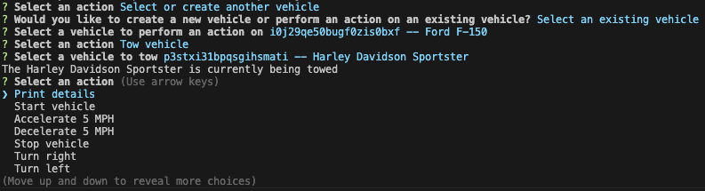

<a id="readme-top"></a>

<!-- PROJECT TITLE -->
# <a id="title"></a>Vehicle Builder #

[](https://opensource.org/licenses/MIT)

<!-- PROJECT DESCRIPTION -->
## <a id="description"></a>Description ##

This CLI application allows the user to create different types of vehicles and perform actions on a selected vehicle. 

This project contains:


<!-- TABLE OF CONTENTS -->
## Table of Contents

- [Description](#description)
- [Installation](#installation)
- [Usage](#usage)
- [Tests](#tests)
- [Contributing](#contributing)
- [Questions](#questions)
- [License](#license)

<!--- INSTALLATION INSTRUCTIONS -->
## <a id="installation"></a>Installation ##

1. Clone the repository.

```bash
git clone https://github.com/your_username_/Project-Name.git
```
2. Install NPM packages 

```bash
npm install
```

<p align="right">(<a href="#readme-top">back to top</a>)</p>

<!-- PROJECT USAGE -->
## <a id="usage"></a>Usage ##

1. Run the npm script "npm run build && node dist/index.js":

```bash
npm run start
```

2. Select an option from the following question: 

```bash
? Would you like to create a new vehicle or perform an action on an existing vehicle? (Use arrow keys)
❯ Create a new vehicle 
  Select an existing vehicle 
```

**Create a new vehicle:** Will prompt for a selection (Car, Truck Motorbike). Then asks a series of questions to a create vehicle. Example:

```bash
? Select a vehicle type Car
? Enter Color Black
? Enter Make BMW
? Enter Model x3
? Enter Year 2025
etc...
```

**Select an existing vehicle:** Will prompt a list of vehicles to perform an action upon. Example:

```bash
? Select a vehicle to perform an action on (Use arrow keys)
❯ p3stxi31bpqsgihsmati -- Harley Davidson Sportster 
  i0j29qe50bugf0zis0bxf -- Ford F-150 
  6txhkbmg6x6lqce2b7nspp -- Toyota Camry 
  pt2w0ca13f05tmx26doq64 -- BMW x3 
```

3. Options to perform on a vehicle include the following:

- Print details
- Start vehicle
- Accelerate 5 MPH
- Decelerate 5 MPH
- Stop vehicle
- Turn right
- Turn left
- Reverse
- Select or create another vehicle
- Tow vehicle
- Wheelie
- Exit

**Example:** Action output for the 'Tow Vehicle' selection:



<p align="right">(<a href="#readme-top">back to top</a>)</p>

<!-- TESTING REQUIREMENTS -->
## <a id="tests"></a>Tests ##

Debugging information for Visual Studio Code 1.10+

- In the Debug panel, click the settings icon to open .vscode/launch.json. Select "Node.js" for initial setup.
- See https://github.com/microsoft/vscode for more information.
- Learn more about debugging Node.js: https://nodejs.org/en/learn/getting-started/debugging

<p align="right">(<a href="#readme-top">back to top</a>)</p>

<!-- CONTRIBUTIONS -->
## <a id="contributing"></a>Contributing ##

For suggestions regarding this application, please fork the repository and create a pull request. 

1. Fork the project. Instructions here: https://docs.github.com/en/pull-requests/collaborating-with-pull-requests/working-with-forks/fork-a-repo
2. Create a feature branch: `git checkout -b feature/<branch-name>`
3. Commit the changes: `git commit -m "<commit-message>"`
4. Push to the branch: `git push origin feature/<branch-name>`
5. Open a pull request.

**Option:** Open an issue and tag "enhancement"

Don't forget to give the project a star!

<p align="right">(<a href="#readme-top">back to top</a>)</p>

<!-- CONTACT/QUESTIONS -->
## <a id="questions"></a>Questions ##

For questions about the application, please contact:

**GitHub Username:** ws-data-engineering

**Email:** ws.data.engineering@gmail.com

<p align="right">(<a href="#readme-top">back to top</a>)</p>

<!-- LICENSE INFORMATION -->
## <a id="license"></a>License ##

<a href="https://opensource.org/licenses/MIT">MIT</a>
<p align="right">(<a href="#readme-top">back to top</a>)</p>